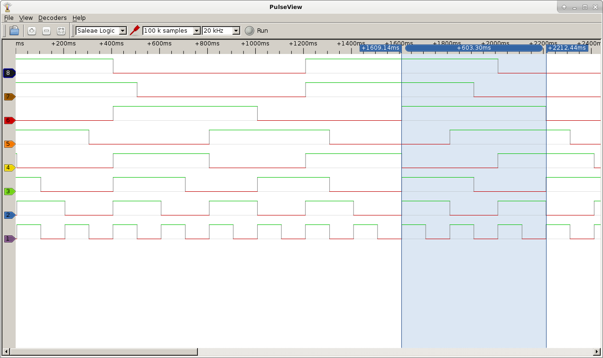
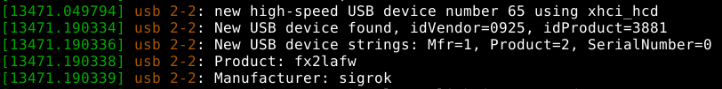
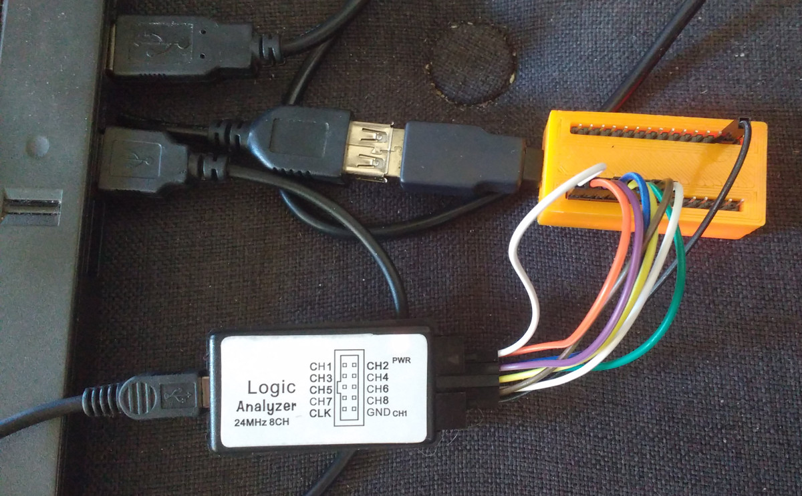
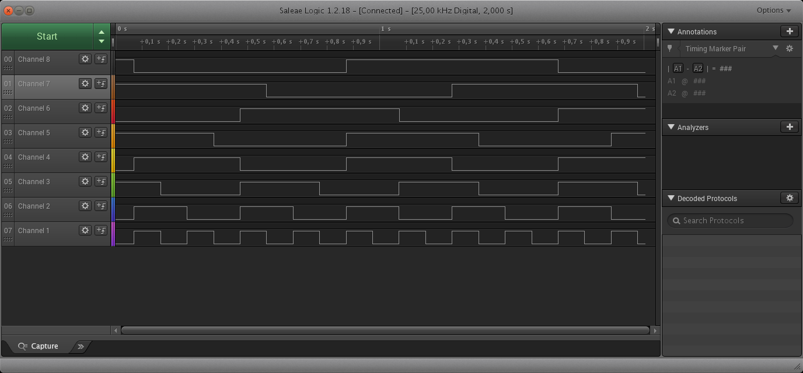

# Arduino Logic Analyzer Test
A little arduino programm that writes out a simple test pattern on 8 pins that can be used to test a logic analyzer.



## Hardware
---

#### VKTECH Saleae Logic Analyzer Clone
Recently I bought a cheap VKTECH Saleae logic analyzer clone from  [*www.aliexpress.com*](https://www.aliexpress.com/wholesale?catId=0&initiative_id=SB_20180421020406&SearchText=VKTECH+usb+logic+analyzer).


The product itself is cheap but it works. Just the cables that shipped with it were crap and had to be replaced from start.
The logic analyzer has 8 channels for input and one pin for ground. 
One pin is labeled CLK that is said to give out a clock signal for synchronisation, but I did not test that. 
When the analyzer is powered up via the usb port a red led lights up. 
When there is data on channel/pin 1 the green led lights up which indicates that everything is working as expected.  

When you plug in the logic analyzer the device is recognized as an usb device with "ID 0925:3881 Lakeview Research Saleae Logic".


#### Arduino Nano
I bought a cheap chinese clone of the arduino nano on [*aliexpress*](https://www.aliexpress.com/item/1PCS-MINI-USB-Nano-V3-0-ATmega328P-CH340G-5V-16M-Micro-controller-board-for-arduino-NANO/32848298184.html) and encased it in a 3D printed housing from [*thingiverse*](https://www.thingiverse.com/thing:959057).
[*Here*](http://www.circuitstoday.com/arduino-nano-tutorial-pinout-schematics) you can find a good pinout diagram of the arduino nano.

#### Wiring
---

|  Nano  |  Analyzer  |
|--------|------------|
| PIN 5  | CH 1 |
| PIN 6  | CH 2 |
| PIN 7  | CH 3 |
| PIN 8  | CH 4 |
| PIN 9  | CH 5 |
| PIN 10 | CH 6 |
| PIN 11 | CH 7 |
| PIN 12 | CH 8 |
| GND    | GND  |



As you can see on the picture I have wired the pins in reverse order which is no problem. The result is that the first and the last channel are reversed in the analyzer software. I powered both the arduino nano and the logic analyzer via usb cable.

## CODE
---
This is the small arduino sketch I used for testing all 8 channels of the logic analyzer.
Each of the output pins is toggled a fixed amount of time after the previous channel is toggled in order to get that kind of pattern.
```C++
/**
  LogicTester

  Switches on and off 8 digital pins in a specific pattern. This can be used to test a logic analyzer.

 see also: 
  https://iamzxlee.wordpress.com/2015/09/15/usb-logic-analyzer-review/
**/

// Pins used for arduino nano are pins 5 to 12: 
// see http://www.circuitstoday.com/arduino-nano-tutorial-pinout-schematics
const unsigned short START_PIN=5;
const unsigned short END_PIN=12;
const unsigned short PIN_RANGE=END_PIN-START_PIN+1;
const unsigned long ULONG_MAX=4294967295;
const unsigned int time2wait=100;

void setup()
{
  for ( unsigned short pin=START_PIN; pin<=END_PIN; ++pin )
  {
    pinMode(pin, OUTPUT);
    digitalWrite(pin, HIGH);
  }
}

void loop()
{
    unsigned long counter = 1;
    unsigned short channel = 1;
    unsigned short pin = 0;
    for(  counter=1; counter<=ULONG_MAX; ++counter )
    {
        delay(time2wait);
        for(channel=1; channel<=PIN_RANGE; ++channel)
        {
            if (counter%channel == 0)
            {
                pin=channel+START_PIN-1;                // calculate output pin from channel
                digitalWrite(pin, !digitalRead(pin));   // toggle output pin
            }
        }
    }
}
```
## SOFTWARE
---


#### sigrok 
The [*sigrok project*](https://sigrok.org/) aims at creating a portable, cross-platform, Free/Libre/Open-Source signal analysis software suite that supports various device types (e.g. logic analyzers, oscilloscopes, and many more). 
On my debian system the installation was simple:<br>
```bash
$ sudo apt-get install sigrok
```
Here I scan for connected devices:
```bash
$ sigrok-cli --scan
The following devices were found:
demo - Demo device with 12 channels: D0 D1 D2 D3 D4 D5 D6 D7 A0 A1 A2 A3
fx2lafw - Saleae Logic with 8 channels: 0 1 2 3 4 5 6 7

$ sigrok-cli --driver fx2lafw --show
fx2lafw:conn=2.31 - Saleae Logic with 8 channels: 0 1 2 3 4 5 6 7
Supported driver options:
    conn
Supported configuration options:
    Supported triggers: 0 1 
    samplerate - supported samplerates:
      20 kHz
      25 kHz
      50 kHz
      100 kHz
      200 kHz
      250 kHz
      500 kHz
      1 MHz
      2 MHz
      3 MHz
      4 MHz
      6 MHz
      8 MHz
      12 MHz
      16 MHz
      24 MHz
```

The sigrok gui for logic analyzers is called [PulseView](https://sigrok.org/wiki/Getting_started_with_a_logic_analyzer).


This software worked out of the box and I found it very convinient. 
I configured it to use the "Saleae Logic" driver instead of the "Demo Device" and took 100k of samples in a 20kHz frequency.
In the View menu chose "Zoom to Fit" which makes it easier to get a good overview of the sample data taken.
You can zoom the view in and out with the mouse scroll wheel anytime. To measure the timing between to points you can choose "Show Cursors" in the View menu.

#### saelogic
Just for comparison I downloaded the original software from the [Saleae website](https://www.saleae.com/downloads). 
I did not have to install anything - only unzip it and start the proviced executable on the commandline:
```
$ ./Logic
```


The software worked fairly well too, but I prefer the PulseView software for daily work till now.<br>
<br>

## License
---
Distributed under the MIT License.

## References
---
* https://sigrok.org/wiki/VKTECH_saleae_clone
* https://sigrok.org/wiki/Getting_started_with_a_logic_analyzer
* https://sigrok.org/wiki/Downloads
* https://iamzxlee.wordpress.com/2015/09/15/usb-logic-analyzer-review/
* https://www.saleae.com/downloads
* http://www.electronicdesign.com/test-amp-measurement/get-most-out-your-logic-analyzer
* http://www.circuitstoday.com/arduino-nano-tutorial-pinout-schematics
* https://www.thingiverse.com/thing:959057

## Authors:
---
* quirxi (https://github.com/quirxi)
